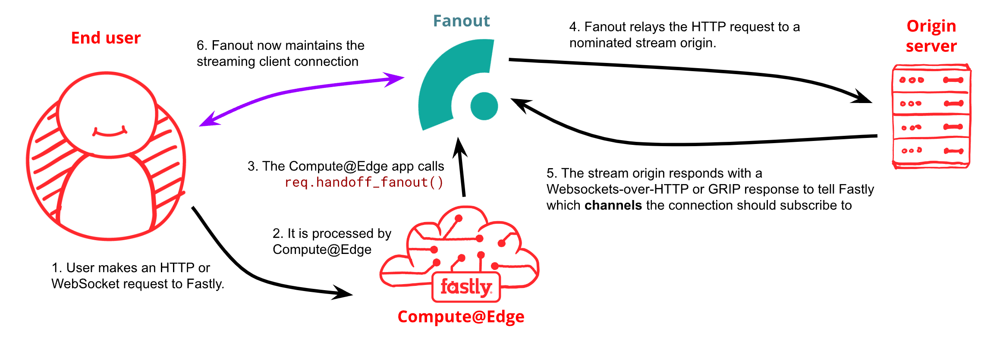
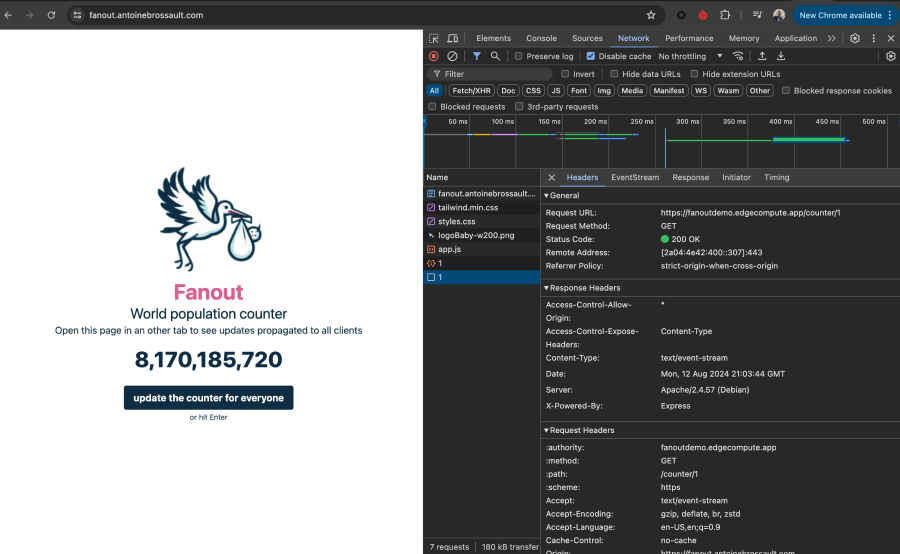

# Fanout JavaScript Demo 


Fastly Fanout enhances real-time communication management in your application. One of the standout features of Fanout is its ability to maintain open connections on your behalf.

In a typical WebSocket scenario, you establish a live connection between the client and server. If the server goes offline, the connection is interrupted.

However, with Fanout, you don't need to manage the live connection with the client yourself—Fanout handles that for you.

You might wonder, "How can I publish events to individual clients if I’m not managing the connection?" 

The answer is simple: you can send messages to clients by making a REST API call. Fanout will then deliver those messages using a pub/sub mechanism


## Architecture 

[]()

### Components 

To use fanout, you need two components. The first one is a Compute@Edge app that will interact with Fanout. 

The second component is your origin, which responds to WebSocket connections and/or event streams.


## Deploy this demo 

[]()

To deploy this demo you will need : 

- Access to the Fastly CLI 
- Basic knowledge of Fastly Compute 
- Basic knowledge of Node.js 
- A Fastly API Key


### Deploy Compute@Edge app

### Deploy the Node.js App somewhere


## How to subscribe

In this demo, when the user lands on the HomePage, a request is made to the origin to get the count:

``` 
curl 'https://fanout.antoinebrossault.com/counter/1'
```  

Note: This request could go through the Compute@Edge app, but for clarity, I'm using the origin domain when it's not mandatory.

Then the count is displayed and added to the Document Object Model.

Directly after that, an event stream request is made to listen for any events:

```
curl 'https://fanoutdemo.edgecompute.app/counter/1' \
  -H 'accept: text/event-stream' 
```

The connection will hang and wait for new data.

That request goes through the Compute@Edge app, and the connection is handed off to Fanout:

```JavaScript
return createFanoutHandoff(event.request, "fanout_antoinebrossault_com");
```

By the way, this request is handed to Fanout because we check if the request contains a specific header.

You can see that in the code 


```JavaScript 

/// <reference types="@fastly/js-compute" />

import { env } from "fastly:env";
import { createFanoutHandoff } from "fastly:fanout";

addEventListener("fetch", (event) => event.respondWith(handleRequest(event)));

/**
 * @param { FetchEvent } event
 */
async function handleRequest(event) {

  // Log service version.
  console.log("FASTLY_SERVICE_VERSION: ", env("FASTLY_SERVICE_VERSION") || "local");

  let shouldHandoffToFanout = false;
  if (
    event.request.method === 'GET' &&
    event.request.headers.get('upgrade')?.split(',').some(x => x.trim() === 'websocket')
  ) {
    // If a GET request is an "Upgrade: websocket" request, then we also pass it through Fanout
    // to handle as WebSocket-over-HTTP.
    // For details on WebSocket-over-HTTP, see https://pushpin.org/docs/protocols/websocket-over-http/
    shouldHandoffToFanout = true;
  } else if (event.request.method === 'GET' || event.request.method === 'HEAD') {
    // If it's a GET or HEAD request, then we will pass it through Fanout
    shouldHandoffToFanout = true;
  }

  // NOTE: In an actual app we would be more selective about which requests
  // are handed off to Fanout, because requests that are handed off to Fanout
  // do not pass through the Fastly cache. For example, we may examine the
  // request path or the existence of certain headers.

  if (shouldHandoffToFanout) {
    // createFanoutHandoff creates a "Response" that, when processed by
    // event.respondWith(), will perform a passing off the original request,
    // through Fanout, to the declared backend.

    // NOTE: The request handed off to Fanout is the original request
    // as it arrived at Fastly Compute. Any modifications made to the request
    // before calling createFanoutHandoff() will not be seen by the backend.
    return createFanoutHandoff(event.request, "fanout_antoinebrossault_com");
  }

  // Send the request to the declared backend normally.
  return fetch(event.request, { backend: "fanout_antoinebrossault_com" });
}

```

with ```createFanoutHandoff(event.request, "fanout_antoinebrossault_com");``` Fanout will hold the connection for us. 

At the origin we will receive the request from Fanout, here's how to handle the request that went trough the ```createFanoutHandoff``` : 


```JavaScript
    if (req.headers.accept === 'text/event-stream' && req.get('Grip-sig')) {

    }
```

First of all, a ```'grip-sig'``` header needs to be added so we know it's coming from ```createFanoutHandoff```. Later on, we could use the ```grip-sig``` header value to validate where the request is coming from.

Then we need to ask fanout to keep the connection open by setting the following header:

```JavaScript
res.setHeader('Grip-Hold', 'stream');
```

Then we need to subscribe that request to a topic or channel. To so so :

```JavaScript
res.setHeader('Grip-Channel', 'counter-' + counterId);
```

Then we set the Content-Type header

```JavaScript
res.setHeader('Content-Type', 'text/event-stream');
```

Then we send the first data

```JavaScript
res.status(200).end(`${JSON.stringify({ value: counter })}\n`)
```


Here the code for that route : 

```JavaScript 

let counter = 0;

app.get('/counter/:id', async (req, res) => {

    counter = calculateCurrentPopulation();
    
    // With Fanout
    if (req.headers.accept === 'text/event-stream' && req.get('Grip-sig')) {
        console.log("All the request headers", req.headers);

        res.setHeader('Grip-Hold', 'stream');
        res.setHeader('Grip-Channel', 'counter-' + counterId);
        res.setHeader('Content-Type', 'text/event-stream');

        console.log("req.headers text/event-stream is set");

        res.status(200).end(`${JSON.stringify({ value: counter })}\n`);
    } else {
        res.json({ value: counter });
    }
});
```


## How to publish

Now to publish an update to all the users who subscribe to the topic/channel, remember that our users subscribed to the channel when they received that header:

```JavaScript 
res.setHeader('Grip-Channel', 'counter-' + counterId);
```

To publish an update to those users we have to POST to this Fastly API endpoint 

```
https://api.fastly.com/service/<FASTLY_SERVICE_ID>/publish/
```

The ```<FASTLY_SERVICE_ID>``` is the one from the compute@Edge app you will find in the ```compute@EdgeFanoutApp``` folder.

With those headers : 


```
'Fastly-Key': process.env.FASTLY_KEY,
'Content-Type': 'application/json',
```


And this JSON payload : 


```JavaScript
 {
        items: [
            {
                channel: `counter-${counterId}`,
                formats: {
                    'http-stream': {
                        content: `data: ${JSON.stringify({ value: counterValue })}\n\n`,
                    },
                },
            },
        ],
    };
```


Here's the function I created where ```counterValue``` is the value I'm sending to the subscriber of the ```counterId``` topic/ channel 


```JavaScript
const publishUpdate = async (counterValue, counterId) => {
    const url = `https://api.fastly.com/service/${process.env.FASTLY_SERVICE_ID}/publish/`;

    console.log("Sending to URL", url);

    const headers = {
        'Fastly-Key': process.env.FASTLY_KEY,
        'Content-Type': 'application/json',
    };

    const data = {
        items: [
            {
                channel: `counter-${counterId}`,
                formats: {
                    'http-stream': {
                        content: `data: ${JSON.stringify({ value: counterValue })}\n\n`,
                    },
                },
            },
        ],
    };

    try {
        const res = await axios.post(url, data, { headers });
        console.log(res.status);
    } catch (error) {
        console.error('Failed to publish update:', error);
    }
};
```


Note: The important point here is that I do not maintain any connections myself. Fanout does it for me, and I simply publish updates by calling the API endpoint I mentioned.

In other words, if my origin is unresponsive or restarts, I’m still able to maintain this realtime connection with Fanout.

